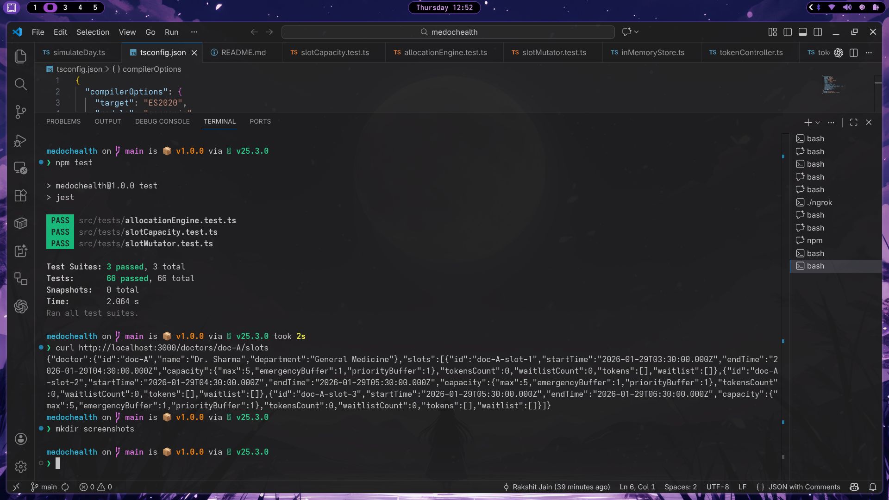

# Hospital OPD Token Allocation Engine

A backend service that manages token allocation for hospital Out-Patient Department (OPD) appointments. The system handles patient tokens with priority-based allocation, emergency and priority buffers, automatic displacement of lower-priority tokens, and waitlist management. All allocation decisions follow deterministic logic, ensuring consistent and predictable behavior across identical inputs.

---

## Sample API Output



This screenshot shows a successful response from the GET /doctors/:doctorId/slots API. It confirms that the server is running, in-memory data is initialized, and slot/token allocation logic is functioning as expected.

---

## Key Design Highlights

- **Domain-Driven Design**: Core domain types (`Token`, `Slot`, `Doctor`) are cleanly separated from business logic and API concerns.

- **Separation of Decision vs Mutation**: The allocation engine (`allocationEngine.ts`) only *decides* what should happen. The slot mutator (`slotMutator.ts`) *applies* those decisions. This separation makes the logic easier to test and reason about.

- **Deterministic & Testable Logic**: All allocation decisions are pure functions with no side effects. Given the same slot state and token, the result is always identical.

- **No Database, No UI**: The project uses an in-memory store and exposes a REST API. There is no persistence layer or frontend—this is intentional to focus on core logic correctness.

---

## Project Structure

```
src/
├── domain/          # Core types: Token, Slot, Doctor, enums
├── services/        # Business logic (allocation, capacity, mutation)
├── store/           # In-memory data store with sample doctors/slots
├── controllers/     # Thin request handlers (delegates to services)
├── api/             # Express route definitions
├── tests/           # Jest unit tests for service layer
└── simulation/      # Day simulation script for manual testing
```

| Folder | Purpose |
|--------|---------|
| `domain/` | Type definitions and enums (no logic) |
| `services/` | Core allocation logic—source of truth for all decisions |
| `store/` | In-memory store initialized with sample data |
| `controllers/` | HTTP handlers—thin layer, no business logic |
| `api/` | Route bindings for Express |
| `tests/` | Unit tests for allocation, capacity, and mutation logic |
| `simulation/` | Script to simulate a full OPD day with events |

---

## How to Run Locally

```bash
# Install dependencies
npm install

# Run tests
npm test

# Start the server
npx ts-node src/index.ts
```

The server runs on `http://localhost:3000`.

---

## API Endpoints

### GET /doctors/:doctorId/slots

Returns all slots for a doctor, including tokens and waitlist.

```bash
curl http://localhost:3000/doctors/doc-A/slots
```

---

### POST /tokens

Creates a new token and allocates it to a slot.

```bash
curl -X POST http://localhost:3000/tokens \
  -H "Content-Type: application/json" \
  -d '{
    "doctorId": "doc-A",
    "slotId": "doc-A-slot-1",
    "patientId": "patient-001",
    "source": "ONLINE",
    "priority": 40,
    "movable": true
  }'
```

**Request Body:**

| Field | Type | Description |
|-------|------|-------------|
| doctorId | string | Doctor ID (e.g., `doc-A`) |
| slotId | string | Slot ID (e.g., `doc-A-slot-1`) |
| patientId | string | Patient identifier (optional) |
| source | string | `ONLINE`, `WALK_IN`, `PRIORITY`, `FOLLOW_UP`, `EMERGENCY` |
| priority | number | `20` (LOW), `40` (MEDIUM), `60` (HIGH), `80` (VERY_HIGH), `100` (EMERGENCY) |
| movable | boolean | Whether the token can be displaced (default: `true`) |

**Response includes:**
- `result.status`: `ALLOCATED`, `DISPLACED`, `WAITLISTED`, or `REJECTED`
- `result.allocatedToken`: The token that was created
- `result.displacedToken`: The token that was displaced (if applicable)

---

### POST /tokens/:tokenId/cancel

Cancels a token and promotes the highest-priority waitlisted token.

```bash
curl -X POST http://localhost:3000/tokens/doc-A-doc-A-slot-1-1234567890-abc123/cancel
```

---

### POST /tokens/:tokenId/no-show

Marks a token as no-show and promotes from waitlist.

```bash
curl -X POST http://localhost:3000/tokens/doc-A-doc-A-slot-1-1234567890-abc123/no-show
```

---

## Testing

- **Framework**: Jest with ts-jest
- **Scope**: Pure logic tests only (no API tests, no mocks)
- **Location**: `src/tests/`

```bash
npm test
```

**Test coverage includes:**
- Direct allocation when capacity available
- Emergency and priority buffer allocation
- Displacement of lower-priority movable tokens
- Waitlist addition and priority-based promotion
- Rejection when slot is full and no displacement possible
- Edge cases: non-movable tokens, emergency source protection, empty slots

All tests target the service layer functions directly, validating that the allocation engine produces correct decisions for all scenarios.

---

## Notes for Assessment Reviewer

1. **Source of Truth**: All allocation logic lives in `src/services/`. The `allocationEngine.ts` file contains the core decision logic; `slotMutator.ts` applies those decisions.

2. **Thin API Layer**: Controllers and routes contain no business logic—they only parse requests, call services, and return responses.

3. **In-Memory Store**: Data is held in `src/store/inMemoryStore.ts` and resets on server restart. Three sample doctors with slots are pre-loaded.

4. **Project Completeness**: This project represents Phase 7 of the implementation. Core allocation logic, tests, and API are complete and final.
